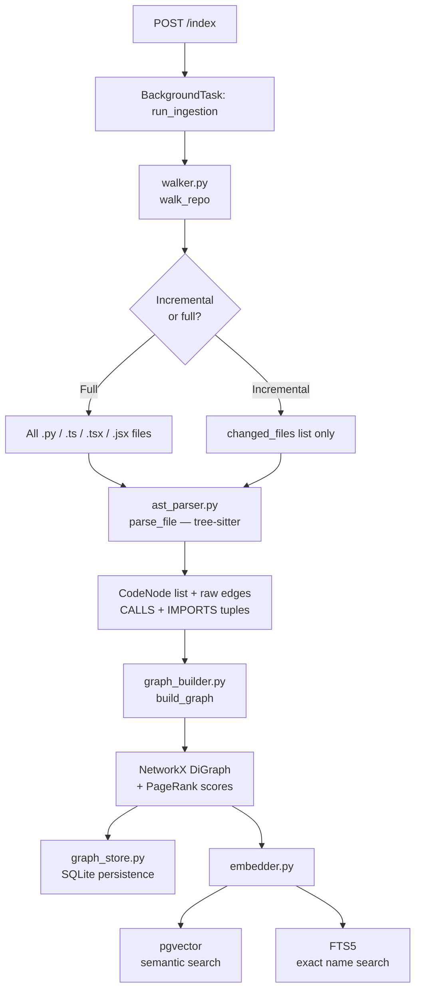
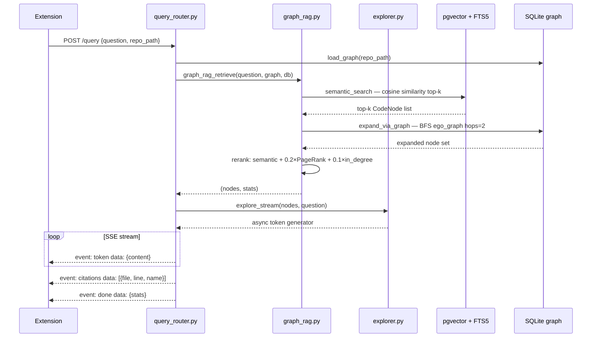
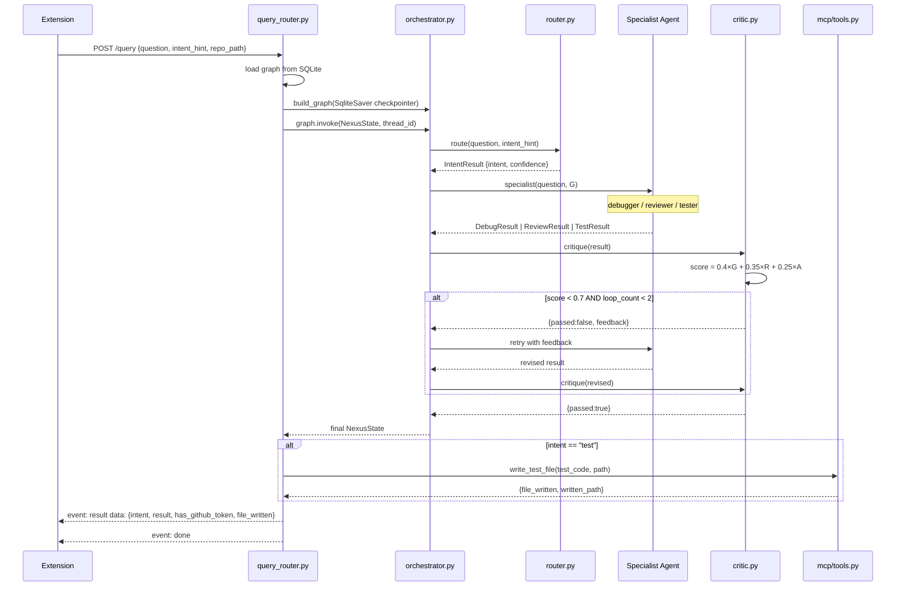

# Backend

FastAPI service that ingests code repositories into a graph + vector store and answers queries through a multi-agent pipeline.

---

## Directory Structure

```
backend/
├── app/
│   ├── main.py               # FastAPI entry point, lifespan, CORS
│   ├── config.py             # Pydantic settings (@lru_cache, .env-driven)
│   ├── api/
│   │   ├── index_router.py   # POST /index, GET /index/status, DELETE /index
│   │   └── query_router.py   # POST /query — SSE streaming (V1 + V2 branches)
│   ├── core/
│   │   └── model_factory.py  # Provider-agnostic LLM + embedding factory
│   ├── ingestion/
│   │   ├── walker.py         # Repository file discovery (respects .gitignore)
│   │   ├── ast_parser.py     # tree-sitter AST extraction → CodeNode list
│   │   ├── graph_builder.py  # NetworkX DiGraph + PageRank
│   │   ├── graph_store.py    # SQLite persistence for graphs
│   │   ├── embedder.py       # pgvector + FTS5 dual storage
│   │   └── pipeline.py       # Full ingestion orchestration
│   ├── retrieval/
│   │   └── graph_rag.py      # 3-step retrieval (semantic → BFS → rerank)
│   ├── agent/
│   │   ├── orchestrator.py   # LangGraph StateGraph — V2 entry point
│   │   ├── router.py         # Intent classifier
│   │   ├── debugger.py       # Call-graph traversal + anomaly scoring
│   │   ├── reviewer.py       # Structured code findings
│   │   ├── tester.py         # Test code generation
│   │   ├── critic.py         # Quality gate (deterministic scoring)
│   │   ├── explorer.py       # V1 streaming agent (unchanged)
│   │   └── prompts.py        # Shared system prompt (anti-fabrication rules)
│   ├── mcp/
│   │   └── tools.py          # GitHub PR posting + safe test file writing
│   ├── models/
│   │   └── schemas.py        # Pydantic models (CodeNode, QueryRequest, …)
│   └── db/
│       └── database.py       # PostgreSQL init + pgvector table setup
├── tests/                    # 190 unit + integration tests (all offline)
├── Dockerfile
├── pytest.ini
└── requirements.txt
```

---

## High-Level Design

The backend has three independent concerns:

1. **Ingestion** — parse the repo into a typed graph and store it in two indexes (SQLite for structure, pgvector for semantics)
2. **Retrieval** — given a query, pull relevant nodes using a 3-step graph-RAG pipeline
3. **Agents** — route the query to a specialist agent that reasons over the retrieved context

These are wired together at the API layer (`query_router.py`), which chooses the V1 path (retrieval → stream) or V2 path (orchestrator → structured result) based on `intent_hint` in the request.

---

## Ingestion Pipeline

### Flow



### Components

**`walker.py`** — Traverses repo depth-first, reads `.gitignore` at every level (via `pathspec`). Skips `.git`, `node_modules`, `__pycache__`, oversized files (> 500 KB). Returns `FileEntry(path, language, size_kb)`.

**`ast_parser.py`** — tree-sitter extracts functions, classes, methods with signatures, docstrings, body preview (max 300 chars), cyclomatic complexity, and line numbers. Emits raw edge tuples `(source_id, target_name, CALLS|IMPORTS)`. Runs 10 workers concurrently via `asyncio.Semaphore`.

**`graph_builder.py`** — Resolves `CALLS` edges by name matching; resolves `IMPORTS` edges by file path linking. Unresolvable edges are dropped. Computes PageRank, in-degree, out-degree on the final graph.

**`embedder.py`** — Batch-embeds nodes (100/batch) via the model factory. Upserts to pgvector with `ON CONFLICT DO UPDATE`. `delete_nodes_for_files()` prunes stale embeddings before incremental re-index.

---

## Query Flow — V1 (Explain / Auto)



---

## Query Flow — V2 (Debug / Review / Test)



---

## Agent Details

### Router (`router.py`)

```
intent_hint ∈ {explain, debug, review, test}
    └─► bypass LLM, confidence = 1.0

LLM classification
    ├─ confidence ≥ 0.6  →  return as-is
    └─ confidence < 0.6  →  force intent = "explain"
```

### Debugger (`debugger.py`)

Anomaly score per traversed node:

| Factor | Weight | Source |
|--------|--------|--------|
| Cyclomatic complexity | 0.30 | AST parser |
| Missing error handling | 0.25 | Keyword absence |
| Bug-keyword match | 0.20 | Query terms in body |
| Out-degree (fan-out) | 0.15 | Graph degree |
| Inverted PageRank | 0.10 | Graph centrality |

Returns top-5 suspects, full traversal path, impact radius (direct callers of top suspect), LLM diagnosis narrative.

### Reviewer (`reviewer.py`)

Assembles `target` node + 1-hop CALLS callers + 1-hop CALLS callees. Calls LLM for structured `Finding` output. Post-filter: any `Finding` whose `file_path` is absent from `retrieved_nodes` is dropped (groundedness enforcement).

### Tester (`tester.py`)

Framework detection order: marker file scan (`pytest.ini`, `jest.config.js`, `vitest.config.*`, `pom.xml`) → `test_*.py` pattern → `unknown` fallback. Test file path is **always derived deterministically** — never generated by the LLM.

### Critic (`critic.py`)

```
score = 0.40 × groundedness   ← deterministic (node ID overlap check)
      + 0.35 × relevance       ← LLM self-assessed
      + 0.25 × actionability   ← LLM self-assessed

if score ≥ 0.7:      passed = True
if loop_count ≥ 2:   passed = True   ← hard termination cap
```

No LLM call in the scoring path — the groundedness check is a pure set-membership test.

---

## LangGraph State

```python
class NexusState(TypedDict):
    question: str
    repo_path: str
    intent_hint: str | None
    G: object | None          # nx.DiGraph — NOT checkpointed (not serializable)
    target_node_id: str | None
    selected_file: str | None
    selected_range: dict | None
    intent: str | None
    specialist_result: object | None
    critic_result: object | None
    loop_count: int
    error: str | None
```

`G` is `Optional[object]` intentionally — `SqliteSaver` cannot JSON-serialize `nx.DiGraph`. Callers supply `G` fresh on every `graph.invoke()` call.

---

## Model Factory

`core/model_factory.py` provides provider-agnostic access:

| Setting | Provider | Model | Dimensions |
|---------|----------|-------|-----------|
| `EMBEDDING_PROVIDER=openai` | OpenAI | `text-embedding-3-small` | 1536 |
| `EMBEDDING_PROVIDER=mistral` | Mistral | `mistral-embed` | 1024 |
| `LLM_PROVIDER=openai` | OpenAI | `MODEL_NAME` | — |
| `LLM_PROVIDER=mistral` | Mistral | `MODEL_NAME` | — |

All agent modules import `get_llm()` **inside function bodies** (lazy import pattern) to prevent `ValidationError` during pytest collection when API keys are absent.

---

## MCP Tools

### `post_review_comments`
Posts inline PR review comments (up to 10). Findings beyond 10 become a single summary comment. Retries on 5xx (exponential backoff via `tenacity`, max 3 attempts). 422 on invalid line numbers logs a warning and skips that finding.

### `write_test_file`
Writes test code to the derived path. Safety guards:
- Rejects paths containing `..` (directory traversal prevention)
- Rejects extensions outside allowlist: `.py .ts .js .tsx .jsx .java .go`
- Respects `overwrite=False` — returns error if file already exists

---

## API Reference

### `POST /index`

```json
{ "repo_path": "/abs/path", "languages": ["python", "typescript"] }
```

Returns `202 Accepted` immediately. Poll `/index/status` for progress.

### `GET /index/status?repo_path=…`

```json
{ "status": "complete", "nodes_indexed": 1247, "files_processed": 83 }
```

Status values: `idle` | `indexing` | `complete` | `failed`

### `DELETE /index?repo_path=…`

Deletes all pgvector rows, FTS5 rows, and SQLite graph data for the repo.

### `POST /query`

```json
{
  "question": "Why is graph_rag_retrieve slow?",
  "repo_path": "/abs/path",
  "intent_hint": "debug",
  "target_node_id": "backend/app/retrieval/graph_rag.py::graph_rag_retrieve"
}
```

**V1 SSE events:**

| Event | Data |
|-------|------|
| `token` | `{"type":"token","content":"..."}` |
| `citations` | `{"type":"citations","citations":[...]}` |
| `done` | `{"type":"done","retrieval_stats":{...}}` |
| `error` | `{"type":"error","message":"..."}` |

**V2 SSE events:**

| Event | Data |
|-------|------|
| `result` | `{"type":"result","intent":"debug","result":{...},"has_github_token":false,"file_written":false}` |
| `done` | `{"type":"done"}` |
| `error` | `{"type":"error","message":"..."}` |

---

## Running Locally

### With Docker (recommended)

```bash
cp .env.example .env
docker-compose up
```

### Without Docker

```bash
python -m venv venv && source venv/bin/activate
pip install -r backend/requirements.txt
cd backend && uvicorn app.main:app --reload --port 8000
```

Requires PostgreSQL 15+ with the `vector` extension installed.

PostgreSQL inside Docker is mapped to **host port 5433** (not 5432) to avoid conflicts:

```bash
psql -h localhost -p 5433 -U $POSTGRES_USER -d $POSTGRES_DB
```

---

## Tests

```bash
source venv/bin/activate
python -m pytest backend/tests/ -v
# 190 passed — no live API calls required
```

| File | Tests | Coverage |
|------|-------|----------|
| `test_ast_parser.py` | 17 | Python + TypeScript parsing, edge cases |
| `test_critic.py` | 10 | Scoring formula, retry routing, 2-loop hard cap |
| `test_debugger.py` | 10 | Traversal order, anomaly scoring, impact radius |
| `test_embedder.py` | 13 | Upsert, FTS5, multi-repo isolation, delete |
| `test_explorer.py` | 9 | Context formatting, SSE token streaming |
| `test_file_walker.py` | 12 | gitignore, language detection, size limit |
| `test_graph_builder.py` | 18 | Edge resolution, PageRank, degree metrics |
| `test_graph_rag.py` | 10 | BFS expansion, reranking, semantic search |
| `test_mcp_tools.py` | 18 | GitHub posting, retry/422 handling, path guards |
| `test_orchestrator.py` | 6 | All 4 intents, retry loop, max_loops termination |
| `test_pipeline.py` | 6 | Full ingestion, incremental re-index, error handling |
| `test_query_router.py` | 8 | V1 SSE event order and content |
| `test_query_router_v2.py` | 8 | V2 all intents, auto sentinel, error propagation |
| `test_reviewer.py` | 10 | Context assembly, schema completeness, groundedness |
| `test_router_agent.py` | 18 | 12 labelled queries, bypass, confidence fallback |
| `test_tester.py` | 17 | Framework detection, mock targets, file path derivation |
