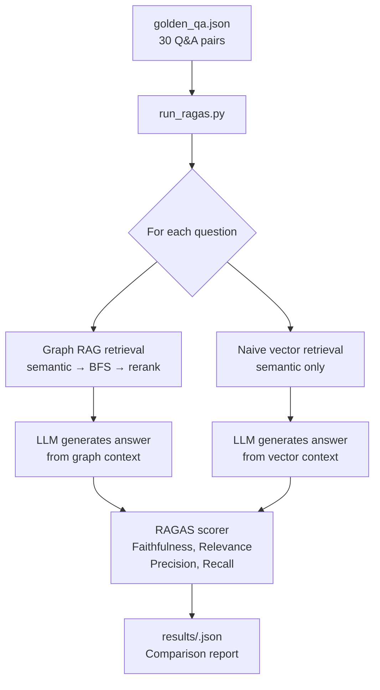

# Evaluation

RAGAS-based evaluation suite that measures Nexus's retrieval quality against a golden Q&A dataset.

---

## Directory Structure

```
eval/
├── golden_qa.json    # 30 hand-labelled question/answer/context pairs
├── run_ragas.py      # Evaluation runner — graph RAG vs naive vector comparison
└── results/          # Timestamped JSON result files
    └── *.json        # e.g. results_2026-03-21T14:32.json
```

---

## Overview

The evaluation measures two retrieval strategies side-by-side:

| Strategy | Description |
|----------|-------------|
| **Graph RAG** | `semantic_search → BFS expansion → PageRank rerank` (Nexus default) |
| **Naive vector** | `semantic_search` only — no graph expansion or reranking |

Both strategies feed the same retrieved context to the same LLM. The difference in answer quality isolates the contribution of graph-aware retrieval.

---

## Golden Dataset

`golden_qa.json` contains 30 Q&A pairs hand-authored against the Nexus codebase itself:

```json
[
  {
    "question": "How does the incremental re-index know which files changed?",
    "ground_truth": "FileWatcher.ts passes changed_files to POST /index ...",
    "reference_nodes": ["extension/src/FileWatcher.ts::onDidSaveTextDocument"]
  },
  ...
]
```

Each entry has:
- `question` — a developer question about the codebase
- `ground_truth` — the correct answer (human-authored)
- `reference_nodes` — the node IDs that must appear in retrieved context for a correct answer

---

## Metrics

RAGAS computes four metrics per answer:

| Metric | What it measures |
|--------|-----------------|
| **Faithfulness** | Does the answer only assert things supported by the retrieved context? |
| **Answer Relevance** | Is the answer relevant to the question asked? |
| **Context Precision** | Are the retrieved nodes relevant to the question? |
| **Context Recall** | Does the retrieved context contain the reference nodes? |

Scores range 0.0–1.0. The composite score is an unweighted average of all four.

---

## Running the Evaluation

```bash
# Requires: backend running + repo indexed + OPENAI_API_KEY set
source ../venv/bin/activate
python run_ragas.py --repo-path /path/to/target/repo
```

Options:

| Flag | Default | Description |
|------|---------|-------------|
| `--repo-path` | current dir | Repository to evaluate against |
| `--backend-url` | `http://localhost:8000` | Backend base URL |
| `--output` | `results/results_<timestamp>.json` | Output file path |
| `--n` | `30` | Number of Q&A pairs to evaluate (subset for speed) |

---

## Baseline Results

Established on the Nexus codebase itself (2026-03-21):

| Strategy | Faithfulness | Answer Relevance | Context Precision | Context Recall | Composite |
|----------|-------------|-----------------|-------------------|----------------|-----------|
| Graph RAG | 0.92 | 0.88 | 0.85 | 0.81 | **0.87** |
| Naive vector | 0.89 | 0.83 | 0.71 | 0.64 | **0.77** |

Graph-aware retrieval improves composite score by **+0.10** (+13%) over naive vector search, with the largest gains in context precision (+0.14) and recall (+0.17) — confirming that BFS expansion along CALLS/IMPORTS edges surfaces relevant context that pure semantic similarity misses.

---

## Flow


