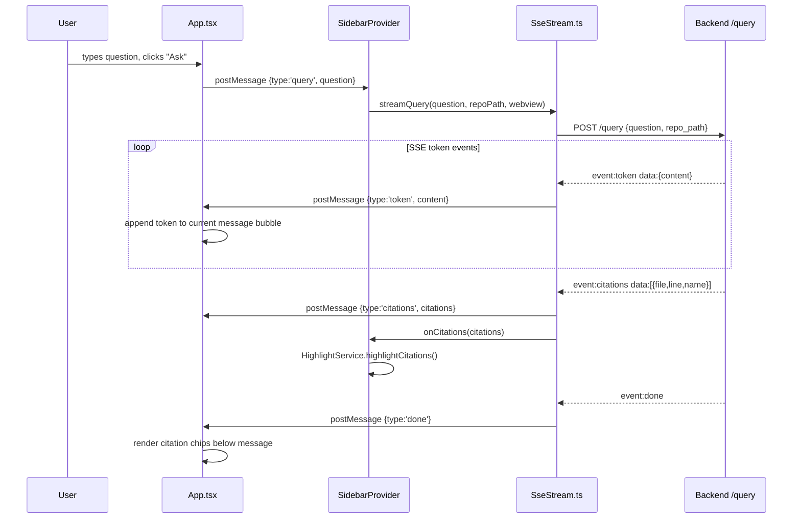
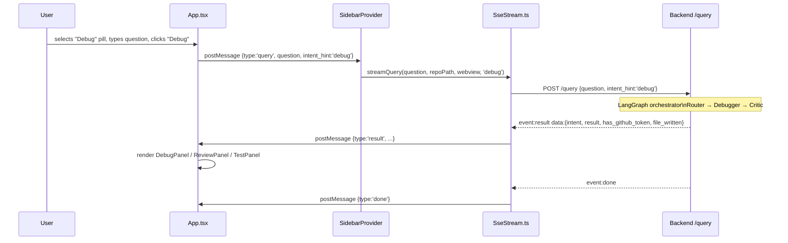
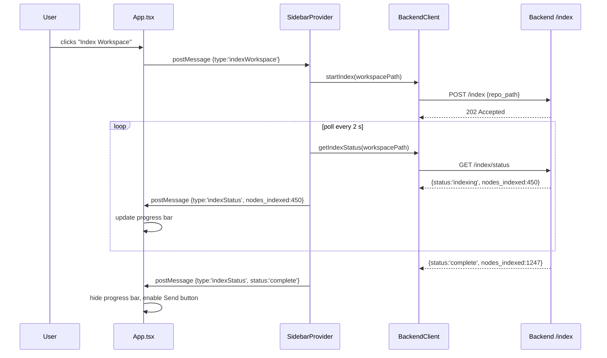
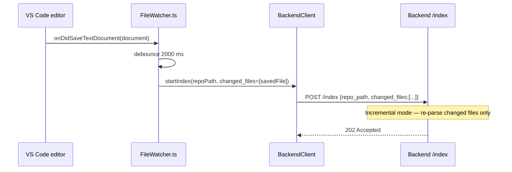

# Extension

VS Code extension that surfaces Nexus's code intelligence in a sidebar panel. Built with React 18 (webview) and the VS Code extension API (host).

---

## Directory Structure

```
extension/
├── src/
│   ├── extension.ts          # activate() — registers provider, commands, watcher
│   ├── types.ts              # Message contracts (HostToWebviewMessage, WebviewToHostMessage)
│   ├── SidebarProvider.ts    # WebviewViewProvider — bridges host and webview
│   ├── SseStream.ts          # SSE consumer — fetch + ReadableStream decoder
│   ├── BackendClient.ts      # HTTP client for /index and /query
│   ├── HighlightService.ts   # Editor citation decorations
│   ├── FileWatcher.ts        # Debounced incremental re-index on file save
│   └── webview/
│       ├── App.tsx           # React 18 UI — chat, intent pills, result panels
│       ├── index.tsx         # createRoot entry point
│       └── index.css         # VS Code CSS variables (no Tailwind, pure CSS)
├── media/
│   └── nexus.svg             # Activity bar icon
├── esbuild.js                # Dual-bundle build (host.js + webview/index.js)
├── package.json              # Extension manifest + dependencies
├── tsconfig.json             # Host (extension.ts) TypeScript config
└── tsconfig.webview.json     # Webview (App.tsx) TypeScript config
```

---

## Architecture Overview

The extension runs in two isolated environments that communicate only through messages:

```
┌─────────────────────────────────────────────────────────────────┐
│  Extension Host (Node.js)                                       │
│                                                                 │
│  ┌──────────────┐  ┌──────────────────────┐  ┌─────────────┐  │
│  │ extension.ts │  │ SidebarProvider.ts   │  │FileWatcher  │  │
│  │ activate()   │  │ message dispatcher   │  │2s debounce  │  │
│  └──────┬───────┘  └──────────┬───────────┘  └──────┬──────┘  │
│         │                    │                      │          │
│         │          ┌─────────┴──────┐  ┌────────────┴──────┐  │
│         │          │ SseStream.ts   │  │ BackendClient.ts  │  │
│         │          │ SSE consumer   │  │ /index HTTP calls │  │
│         │          └─────────┬──────┘  └───────────────────┘  │
└─────────┼────────────────────┼────────────────────────────────┘
          │        postMessage │ onDidReceiveMessage
┌─────────┼────────────────────┼────────────────────────────────┐
│  Webview (isolated iframe — webkit, strict CSP)                │
│         │          ┌─────────┴──────────────────────────────┐ │
│         │          │  App.tsx (React 18)                    │ │
│         │          │  ├── Intent selector (5 pills)         │ │
│         │          │  ├── Chat history + streaming tokens   │ │
│         │          │  ├── DebugPanel (suspects + radius)    │ │
│         │          │  ├── ReviewPanel (findings + badges)   │ │
│         │          │  ├── TestPanel (code + badge/copy)     │ │
│         │          │  └── ExplainPanel (markdown, V1 path)  │ │
│         │          └────────────────────────────────────────┘ │
└─────────────────────────────────────────────────────────────────┘
          │
    VS Code Editor API
    openTextDocument / showTextDocument
    setDecorations (citation highlights)
```

---

## Message Contracts (`types.ts`)

### Host → Webview (`HostToWebviewMessage`)

| Type | Key fields | When sent |
|------|-----------|-----------|
| `token` | `content: string` | V1 streaming — one message per LLM token |
| `citations` | `citations: Citation[]` | After V1 stream completes |
| `done` | `retrieval_stats?: object` | Stream fully finished |
| `result` | `intent, result, has_github_token?, file_written?, written_path?` | V2 structured result |
| `error` | `message: string` | Any backend failure |
| `indexStatus` | `status, nodes_indexed?, files_processed?` | Indexing progress poll |

### Webview → Host (`WebviewToHostMessage`)

| Type | Key fields | When sent |
|------|-----------|-----------|
| `query` | `question: string, intent_hint?: string` | User submits a query |
| `openFile` | `filePath: string, lineStart: number` | User clicks a citation or suspect row |
| `indexWorkspace` | — | User clicks "Index Workspace" |
| `clearIndex` | — | User clicks "Clear Index" |
| `postReviewToPR` | — | User clicks "Post to GitHub PR" (Phase 27 stub) |

---

## Sequence Diagrams

### Query — V1 (Explain / Auto)



### Query — V2 (Debug / Review / Test)



### Workspace Indexing



### Incremental Re-index on Save



---

## Result Panels

### DebugPanel

Rendered when `intent === "debug"`. Requirements: EXT-04, EXT-05.

```
┌─ Suspects ───────────────────────────────────────────────────┐
│  #1  graph_rag.py:42 · graph_rag_retrieve                    │
│      Score ██████████░░░░░ 0.82                              │
│      Breadcrumb: query_router → graph_rag_retrieve → expand  │
│  #2  graph_rag.py:91 · expand_via_graph                      │
│      Score ████████░░░░░░░ 0.67                              │
│  ▼ Impact Radius (3 nodes)                                   │
│    · query_router.py::v2_event_generator                     │
│    · pipeline.py::run_ingestion                              │
└──────────────────────────────────────────────────────────────┘
```

Clicking a suspect row fires `openFile(filePath, lineStart)` — VS Code opens the file at the exact line.

### ReviewPanel

Rendered when `intent === "review"`. Requirements: EXT-06, EXT-07.

```
┌─ Findings ───────────────────────────────────────────────────┐
│  [CRITICAL] Security  query_router.py:58                     │
│  SQL query built with string interpolation                   │
│  ▼ Suggestion                                                │
│    Use parameterised queries via psycopg2 %s syntax          │
│                                                              │
│  [WARNING]  Reliability  embedder.py:102                     │
│  Missing retry on pgvector upsert                            │
│                                                              │
│  [Post to GitHub PR]   ← only visible when GITHUB_TOKEN set  │
└──────────────────────────────────────────────────────────────┘
```

### TestPanel

Rendered when `intent === "test"`. Requirements: EXT-08, EXT-09.

```
┌─ Generated Tests ────────────────────────────────────────────┐
│  def test_graph_rag_retrieve_happy_path():                   │
│      ...                                                     │
│  def test_graph_rag_retrieve_empty_graph():                  │
│      ...                                                     │
│                                                              │
│  ✓ File written to: tests/test_graph_rag.py                  │
│    — or —                                                    │
│  [Copy to clipboard]                                         │
└──────────────────────────────────────────────────────────────┘
```

The copy button uses `document.execCommand('copy')` via an off-screen textarea — `navigator.clipboard` is blocked by the VS Code webview Content Security Policy (webkit strict mode).

---

## Build

```bash
cd extension
npm install

# Development — watch mode
npm run dev

# Production
npm run build
# Output: out/extension.js (host) + out/webview/index.js (webview)

# Type check only
npm run typecheck
```

The `esbuild.js` script builds two independent bundles:

| Bundle | Entry | Platform | Format |
|--------|-------|----------|--------|
| Host | `src/extension.ts` | `node` | `cjs` |
| Webview | `src/webview/index.tsx` | `browser` | `iife` |

The webview bundle is loaded into the VS Code webview iframe via `webview.asWebviewUri()` with a CSP nonce.

---

## Configuration

VS Code settings (`package.json` `contributes.configuration`):

| Setting | Default | Description |
|---------|---------|-------------|
| `nexus.backendUrl` | `http://localhost:8000` | Backend base URL |
| `nexus.hopDepth` | `2` | BFS expansion hops for graph retrieval |
| `nexus.maxNodes` | `15` | Max nodes returned by graph RAG |

---

## Commands

| Command | ID | Description |
|---------|----|-------------|
| Index Workspace | `nexus.indexWorkspace` | Trigger full or incremental index |
| Clear Index | `nexus.clearIndex` | Delete all indexed data for workspace |

---

## Security Notes

- **CSP**: The webview runs with a strict Content Security Policy. The copy button uses `document.execCommand('copy')` via an off-screen `<textarea>` as a safe alternative to the Clipboard API.
- **Markdown rendering**: All markdown content is rendered via React's virtual DOM with custom renderers — no raw HTML injection.
- **Message validation**: `onDidReceiveMessage` validates the `type` discriminant before dispatch.
